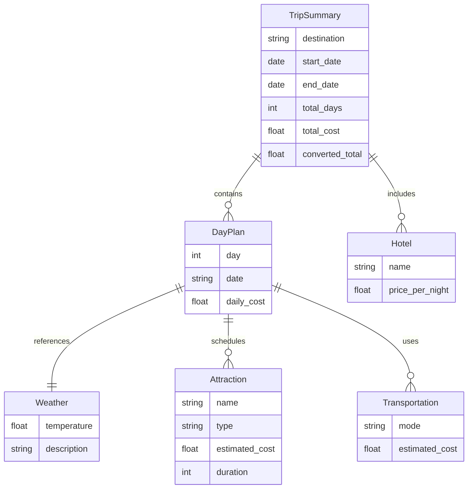
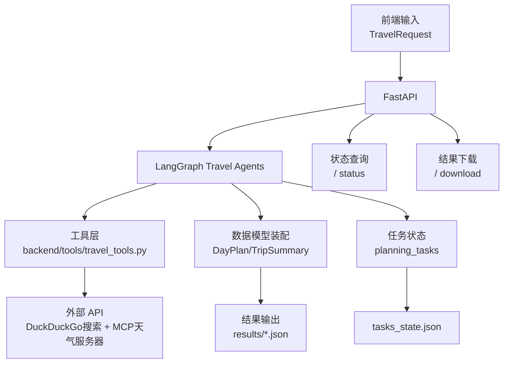

# AI 旅行规划智能体 - 数据设计文档

## 1. 数据设计目标
- 描述旅行规划过程中涉及的核心实体、关系与数据流。
- 指导后续数据库或持久化层扩展（当前默认使用内存 + 文件）。
- 支撑数据归档、报表及与企业系统的对接。

## 2. 数据实体与属性

### 2.1 Weather（天气信息）
| 字段 | 类型 | 说明 |
| ---- | ---- | ---- |
| `temperature` | float | 温度（℃） |
| `description` | str | 天气描述，如“晴” |
| `humidity` | int | 湿度（%） |
| `wind_speed` | float | 风速（ km/h ） |
| `feels_like` | float | 体感温度（℃） |
| `date` | str | 日期（YYYY-MM-DD） |

### 2.2 Attraction（景点/餐饮/活动）
| 字段 | 类型 | 说明 |
| ---- | ---- | ---- |
| `name` | str | 名称 |
| `type` | str | 类型（`attraction` / `restaurant` / `activity`） |
| `rating` | float | 评分（1-5） |
| `price_level` | int | 价格等级（0-4） |
| `address` | str | 地址 |
| `description` | str | 简介 |
| `estimated_cost` | float | 预估成本（USD） |
| `duration` | int | 推荐停留时长（小时） |

### 2.3 Hotel（酒店）
| 字段 | 类型 | 说明 |
| ---- | ---- | ---- |
| `name` | str | 酒店名称 |
| `rating` | float | 评分（1-5） |
| `price_per_night` | float | 每晚价格（USD） |
| `address` | str | 地址 |
| `amenities` | List[str] | 设施（WiFi、早餐等） |

### 2.4 Transportation（交通）
| 字段 | 类型 | 说明 |
| ---- | ---- | ---- |
| `mode` | str | 交通方式 |
| `estimated_cost` | float | 费用（USD） |
| `duration` | int | 时长（分钟） |

### 2.5 DayPlan（每日行程）
| 字段 | 类型 | 说明 |
| ---- | ---- | ---- |
| `day` | int | 第几天 |
| `date` | str | 日期 |
| `weather` | Weather | 天气信息 |
| `attractions` | List[Attraction] | 景点安排 |
| `restaurants` | List[Attraction] | 餐饮安排 |
| `activities` | List[Attraction] | 其他活动 |
| `transportation` | List[Transportation] | 交通方式 |
| `daily_cost` | float | 当日总费用 |

### 2.6 TripSummary（行程总结）
| 字段 | 类型 | 说明 |
| ---- | ---- | ---- |
| `destination` | str | 目的地 |
| `start_date` | date | 开始日期 |
| `end_date` | date | 结束日期 |
| `total_days` | int | 天数 |
| `total_cost` | float | 总费用（原始币种） |
| `daily_budget` | float | 每日预算 |
| `currency` | str | 原始币种 |
| `converted_total` | float | 换算后的总费用 |
| `itinerary` | List[DayPlan] | 每日行程 |
| `hotels` | List[Hotel] | 酒店列表 |
| `trip_overview` | Dict[str, Any] | 行程概览（主题、亮点） |
| `weather_summary` | Dict[str, Any] | 天气总结 |
| `accommodation_summary` | Dict[str, Any] | 住宿总结 |
| `expense_summary` | Dict[str, Any] | 费用总结（交通/餐饮/活动等） |
| `itinerary_highlights` | Dict[str, Any] | 行程亮点呈现 |
| `recommendations` | Dict[str, Any] | 个性化建议 |
| `travel_tips` | List[str] | 出行提示 |

## 3. 关系模型

## 4. 数据流设计

## 5. 数据存储策略
- **运行时内存**：`planning_tasks` 字典保存实时状态，键为 `task_id`。
- **持久化**：
  - `tasks_state.json`：任务状态快照；可替换为 Redis/数据库。
  - `results/*.json`：结果文档，建议定期归档到对象存储或数据库。
- **缓存策略**：
  - `CurrencyConverter` 采用内存缓存，1 小时有效期。
  - 其他模块可按需增加缓存（如景点数据）。

## 6. 数据质量与校验
- 日期与预算在输入阶段校验。
- 外部数据需判空处理，如无结果则使用回退数据。
- 汇率、天气等接入数据应记录更新时刻（可扩展为日志字段）。
- 结果 JSON 包含请求参数、执行时间、生成内容，便于审计。

## 7. 扩展性建议
- 引入数据库（PostgreSQL/MySQL）存储任务与结果，建立任务、行程、POI 等表结构。
- 增加数据仓库或 BI 报表，分析常见目的地、预算偏好等。
- 对结果文件添加版本号与签名，确保数据完整性和可追溯性。
- 针对企业内部系统，可提供数据导出接口（JSON/CSV/PDF）。

---

> 本数据设计文档描述了旅行规划 Agent 的核心实体、数据流与存储策略，为后续数据库落地、数据治理与分析提供参考。业务流程与部署细节请参阅其他文档。

