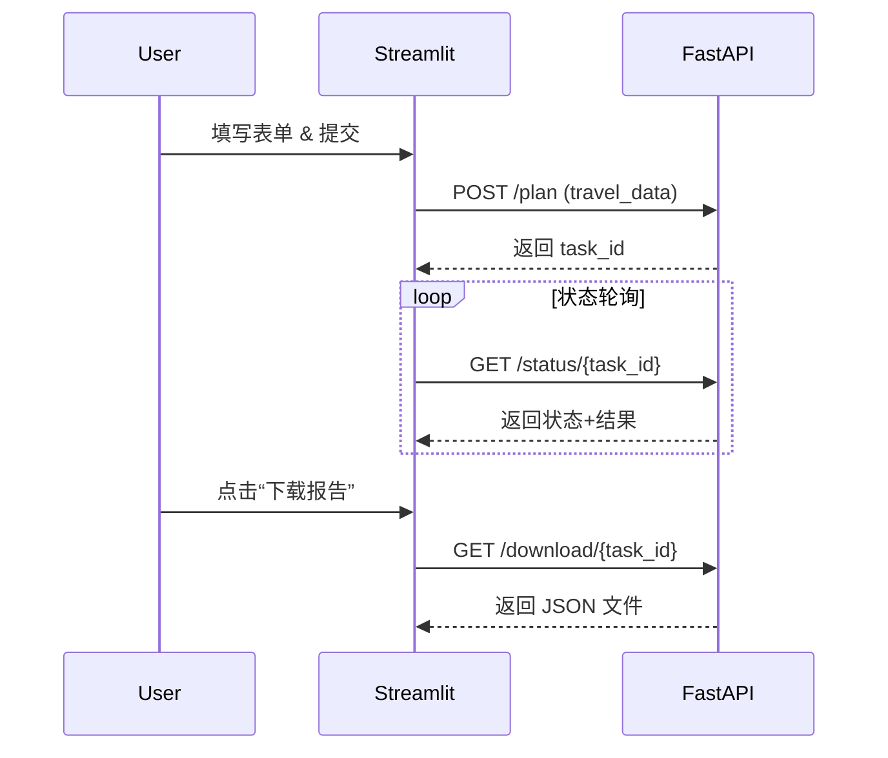

# Streamlit 前端接口调用说明

## 1. 概述
本说明文档梳理 `frontend/streamlit_app.py` 中前端页面调用后端服务的接口，便于企业在生产环境中审计与监控。

## 2. 接口列表
| 前端函数 | 后端接口 | HTTP 方法 | 说明 |
| -------- | -------- | -------- | ---- |
| `check_api_health` | `/health` | GET | 检查后端服务状态，返回配置信息与系统资源。 |
| `create_travel_plan` | `/plan` | POST | 创建旅行规划任务，返回 `task_id`。 |
| `get_planning_status` | `/status/{task_id}` | GET | 查询规划任务进度与结果。 |
| `download_travel_plan` | `/download/{task_id}` | GET | 下载规划结果 JSON 文件（用于前端“下载报告”按钮）。 |
| `list_tasks` *(可选调用)* | `/tasks` | GET | 列出所有任务概览，默认界面未直接调用，可用于运营视图。 |

a> 注：`/simple-plan` 与 `/mock-plan` 由后端提供（见 `backend/api_server.py`），可按需在前端新增按钮接入；当前界面默认使用主规划流程。

## 3. 调用流程


## 4. 调用细节
### 4.1 `/health`
- **函数**：`check_api_health`
- **触发时机**：页面加载时自动调用。
- **超时处理**：15 秒超时；若失败显示错误提示。
- **返回示例**：
  ```json
  {
    "status": "healthy",
    "llm_model": "deepseek-chat",
    "api_key_configured": true,
    "system_info": {
      "cpu_usage": "5%",
      "memory_usage": "42%"
    }
  }
  ```

### 4.2 `/plan`
- **函数**：`create_travel_plan`
- **输入数据**：`TravelRequest`（目的地、日期、预算、兴趣等）。
- **超时策略**：60 秒；失败提示重试或检查后端。
- **返回示例**：`{"task_id": "uuid...", "status": "started"}`

### 4.3 `/status/{task_id}`
- **函数**：`get_planning_status`
- **轮询策略**：最大重试 3 次，每次超时重试等待 1~2 秒。
- **响应字段**：
  - `status`: started/processing/completed/failed
  - `progress`: 0-100
  - `current_agent`: 当前执行节点描述
  - `message`: 当前提示信息
  - `result`: 最终结果（完成后提供）

### 4.4 `/download/{task_id}`
- **触发**：用户点击“下载报告”按钮。
- **返回**：JSON 文件，包含任务请求、执行时间和规划结果。
- **存储**：文件默认位于后端 `results/` 目录。

## 5. 扩展接口
如需在前端集成简化版或模拟版规划，可在界面上添加按钮调用：
- `POST /simple-plan`
- `POST /mock-plan`

调用方式可复用 `requests.post`，并在页面中展示返回结果或提示。

## 6. 监控与日志建议
- 在前端记录每次接口调用的耗时和状态码，便于用户反馈时排查。
- 后端应对 `/plan`、`/status`、`/download` 添加日志（task_id、耗时、错误信息）。
- 在生产环境中，可使用 API Gateway 或 APM（如 Datadog、New Relic）监控接口调用频次与失败率。

---

> 本文档适用于企业运维/前端团队了解前端与后端的接口交互，便于上线前的验证与后续的监控。必要时可进一步扩展为 Swagger 文档或 Postman Collection。
