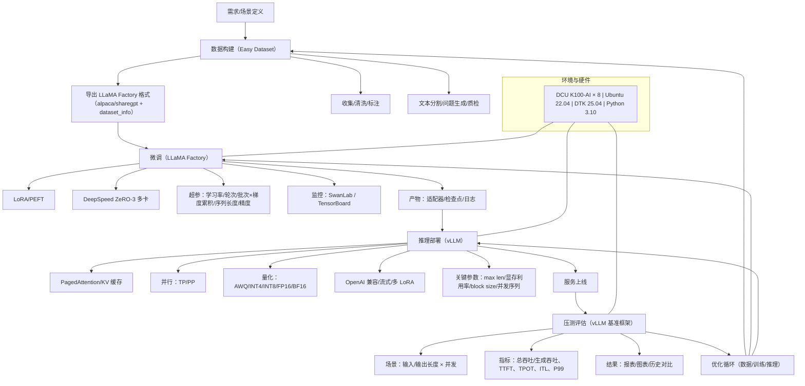

# DeepSeek 32B 大模型微调、推理、压测实战指南

> 面向大模型初学者的完整教程 - 从数据准备到生产部署的端到端解决方案

## 🎯 项目概述

本项目是一个完整的大模型微调实战教程，专为**大模型初学者**设计。通过循序渐进的方式，从大模型基础概念到实际部署应用，帮助你掌握：

### 🎓 学习目标

- **理论基础**：理解大模型微调的核心概念和技术原理
- **数据工程**：掌握行业数据集构建和预处理方法
- **模型训练**：学会使用LoRA技术高效微调DeepSeek-R1模型
- **推理部署**：基于vLLM构建高性能推理服务
- **性能优化**：掌握模型评估与压测方法

### 🏥 应用场景

- **眼科诊断辅助**：智能分析眼部症状，提供初步诊断建议
- **医疗问答机器人**：回答患者常见问题，提供健康指导
- **病历智能分析**：自动提取病历关键信息，辅助医生决策
- **医学知识问答**：专业医学知识查询和解释

### 🌟 项目特色

- **由浅入深**：从基础概念到高级应用，循序渐进
- **实战导向**：每个环节都有具体的代码示例和操作指导
- **行业聚焦**：以眼科医疗为具体应用场景，贴近实际需求
- **工具完整**：集成最新的微调和推理工具链

## 🏗️ 系统架构

```
┌─────────────────────────────────────────────────────────────┐
│                    用户应用层                                │
├─────────────────────────────────────────────────────────────┤
│  Web界面  │  移动应用  │  API接口  │  命令行工具              │
├─────────────────────────────────────────────────────────────┤
│                    推理服务层                                │
│  ┌─────────────────┐  ┌─────────────────┐  ┌──────────────┐  │
│  │   vLLM 0.8.5    │  │   OpenAI API    │  │   REST API   │  │
│  │   推理引擎      │  │   兼容接口      │  │   服务接口   │  │
│  └─────────────────┘  └─────────────────┘  └──────────────┘  │
├─────────────────────────────────────────────────────────────┤
│                    模型服务层                                │
│  ┌─────────────────┐  ┌─────────────────┐  ┌──────────────┐  │
│  │  DeepSeek-R1    │  │   LoRA适配器    │  │   量化模型   │  │
│  │   基础模型      │  │   微调参数      │  │   优化版本   │  │
│  └─────────────────┘  └─────────────────┘  └──────────────┘  │
├─────────────────────────────────────────────────────────────┤
│                    训练框架层                                │
│  ┌─────────────────┐  ┌─────────────────┐  ┌──────────────┐  │
│  │ Llamafactory    │  │   DeepSpeed     │  │   Easy       │  │
│  │   微调框架      │  │   ZeRO-3        │  │   Dataset    │  │
│  └─────────────────┘  └─────────────────┘  └──────────────┘  │
├─────────────────────────────────────────────────────────────┤
│                    基础设施层                                │
│  ┌─────────────────┐  ┌─────────────────┐  ┌──────────────┐  │
│  │  DCU K100-AI    │  │   Ubuntu 22.04  │  │   Python 3.10│  │
│  │   8卡集群       │  │   操作系统      │  │   运行环境   │  │
│  └─────────────────┘  └─────────────────┘  └──────────────┘  │
└─────────────────────────────────────────────────────────────┘
```

### 🔧 核心技术栈

| 技术组件 | 版本 | 作用 | 特点 |
|---------|------|------|------|
| **DeepSeek-R1** | 32B | 基础大语言模型 | 强大的理解和生成能力 |
| **LoRA** | - | 高效微调技术 | 参数高效，训练快速 |
| **DeepSpeed ZeRO-3** | - | 显存优化 | 支持大模型训练 |
| **Llamafactory** | 0.9.2 | 微调框架 | 易用性强，功能完整 |
| **vLLM** | 0.8.5 | 推理引擎 | 高性能，低延迟 |
| **Easy Dataset** | - | 数据集工具 | 简化数据处理流程 |

## 🛠️ 环境要求

### 💻 硬件配置

| 组件 | 最低要求 | 推荐配置 | 说明 |
|------|----------|----------|------|
| **GPU** | DCU K100-AI (4卡) | DCU K100-AI (8卡) | 支持DCU DTK 25.04 |
| **内存** | 64GB | 128GB+ | 大模型训练需要充足内存 |
| **存储** | 200GB | 500GB+ | SSD推荐，用于数据缓存 |
| **网络** | 千兆 | 万兆 | 模型下载和分布式训练 |


## 🧪 本地实战总览



- 覆盖范围：微调、数据构建、推理部署、压测评估（对应 01/02/03/04 文档）
- 目标硬件：DCU K100-AI（推荐 8 卡）
- 工具栈：Easy Dataset、LLaMA Factory、DeepSpeed ZeRO-3、vLLM、SwanLab

### 1) 微调实战要点（01-大模型微调、推理、压测与评估）
- 任务类型：行业问答、病历摘要、文献检索与摘要等
- 数据流程：收集 → 清洗去重 → 标注成对话格式（Alpaca/ShareGPT/COT）→ 质量校验 → 增强（可选）
- 方法与策略：
  - 参数高效微调（LoRA/PEFT），以极少量可训练参数完成迁移
  - 分布式显存优化（DeepSpeed ZeRO-3），支持大模型在多卡上训练
  - 训练配置关注：学习率、训练轮次、批处理与梯度累积、序列长度、精度
- 监控与评估：
  - 过程监控：loss、throughput、学习率、梯度范数、输入 token 计数
  - 效果评估：eval loss 最低点（早停参考）、人工评测（专家主观质检）、必要时做 A/B 测试
- 结论要点：先小样本跑通流程，随后逐步扩数据与训练时长；质量数据是上限决定因素

### 2) Easy Dataset × LLaMA Factory（02-LLaMA Factory：Easy Dataset 让大模型高效学习领域知识）
- 数据构建（Easy Dataset）：
  - 创建项目与模型 API 配置 → 文献/文本分割（长度与重叠）→ 批量生成问题 → 构造数据集
  - 导出 LLaMA Factory 兼容产物（核心文件：dataset_info.json、alpaca.json、sharegpt.json）
- 微调执行（LLaMA Factory）：
  - WebUI 选择基础模型与数据集路径，设置预处理（序列长度、并行预处理）
  - 配置 LoRA 相关参数与训练策略，启动训练并用 SwanLab/TensorBoard 观测
- 实操建议：
  - 有效批处理大小 = 每卡批次 × 梯度累积 × 卡数（综合显存与吞吐进行折中）
  - 显存不足优先调整：序列长度、批次、LoRA 秩；或使用检查点与更高 ZeRO stage
  - 先以少量样本与默认参数贯通流程，再逐步扩容与调参
- 结果验证与导出：
  - 通过加载/卸载检查点对照验证微调前后差异
  - 依据需要导出适配器合并、量化等级、分块大小与目标设备的最终模型

### 3) 推理部署（03-大模型推理部署）
- 设计要点：
  - 高效 KV 缓存（PagedAttention）、连续批处理与统一调度、分块预填充、推测性解码
  - OpenAI 兼容接口、流式输出、结构化输出、张量并行/流水线并行
- 部署实践：
  - 容器化运行（映射模型与驱动、共享内存、设备权限、Host 网络/IPC）
  - 多卡环境与通信优化（设备可见性、通信通道、NUMA 绑定、进程创建方式）
  - 推理关键参数：精度、张量并行、最大上下文、显存利用率、并发序列、量化方案
- DCU 提示：
  - 关注特定内核/优化与 ROCm 的兼容性提示，必要时关闭冲突优化
  - 按模型规模与目标延迟/吞吐，调优张量并行度与显存占用比例

### 4) 压测评估框架（04-vLLM推理服务压测框架：让大模型性能评估有据可依）
- 架构特点：配置驱动、统一入口、结果按“模型_时间戳”组织、自动聚合与可视化
- 关键指标：
  - 吞吐：总吞吐（输入+输出）、生成吞吐（输出生成速度）
  - 延迟：首 token 时间（TTFT）、每 token 时间（TPOT）、迭代延迟（ITL）与对应 P99
  - 端到端：整体基准时长与请求吞吐
- 典型测试场景：组合不同输入/输出长度与并发度，覆盖交互与长文本
- 常见趋势：
  - 输入越长，首 token 时间上升；适度并发能提升总吞吐但会拉高平均延迟
  - 每 token 时间在同一硬件/模型下相对稳定，反映生成阶段的持续效率

### 5) 最佳实践清单
- 跑通优先：先小规模数据与默认参数贯通，再渐进调参与扩容
- 数据为王：严格去重与一致性校验，适度数据增强，持续滚动收集与增量微调
- LoRA 经验：缩放系数与秩保持合理比例；过拟合或遗忘时相向调整
- 资源规划：结合显存计算器预估；用梯度累积模拟大批次，兼顾稳定与吞吐
- 观测闭环：训练阶段看 loss/throughput/eval loss；上线看吞吐、TTFT/TPOT/ITL 及 P99
- 质量保障：结合人工评测与 A/B 测试，保存关键训练阶段的检查点

### 6) 交付物与目录指引
- 数据：Easy Dataset 导出（dataset_info、alpaca、sharegpt）
- 训练：LLaMA Factory 输出（检查点、日志、可视化记录）
- 推理：vLLM 服务配置与模型路径（含并行/量化/内存策略）
- 压测：原始结果、聚合报表与图表（吞吐/延迟/热力图）
