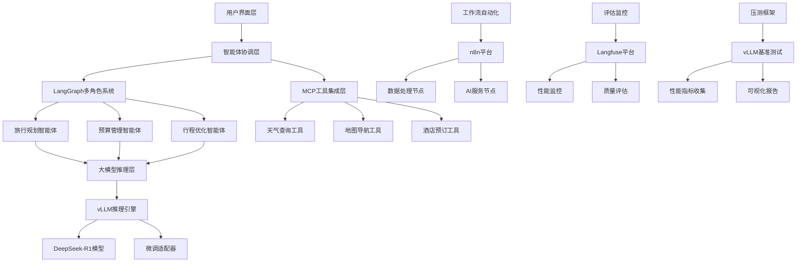

# 从0到1打造多角色AI Agent - 完整学习指南

<div align="center">


**企业级AI旅行规划智能体 · 从理论到实战的全链路开发技能**

[快速开始](#-快速开始) • [课程内容](#-课程内容) • [技术栈](#-技术栈) • [实战项目](#-实战项目) • [环境搭建](#-环境搭建)

</div>

---

## 📚 课程简介

### 🎯 课程目标

本课程聚焦"从零到一"构建企业级AI旅行规划智能体，旨在帮助学员掌握从理论到实战的全链路开发技能。通过实战驱动的学习路径，学员将能够独立开发可商用的AI旅行规划解决方案，并获得在AI应用开发领域的就业竞争力。

### 👥 适合人群

| 人群类型 | 适用场景 | 收获价值 |
|---------|----------|----------|
| **AI开发初学者** | 计算机专业学生或对AI感兴趣的开发者 | 系统学习大模型应用开发 |
| **旅游科技团队** | 需要快速掌握AI旅行规划技术的开发团队 | 实用的技术解决方案 |
| **转型工程师** | 从传统软件开发转向AI+旅游方向 | 新技术栈的掌握和应用 |
| **创业者/产品经理** | 进行产品规划和商业模式探索 | 技术实现的深度理解 |

### 🎨 课程特色

- **📈 通用框架**：核心架构可应用于医疗、金融、科研等不同行业
- **🎯 实战导向**：以完整的AI旅行规划项目为核心案例
- **🔧 技术前沿**：涵盖MCP、n8n、vLLM、多智能体协作等最新技术
- **💼 企业级解决方案**：满足真实业务需求，注重性能优化和成本控制
- **🎓 职业发展**：包含面试技巧和职业规划指导

---

## 📖 课程内容

### 🧭 课程大纲速览

| 序号 | 课程主题 | 配套资料 | 能力产出 |
|------|----------|----------|----------|
| 01 | 🔌 工具链集成 | `01-agent-llm-mcp/` | 让智能体接入外部工具，拓展执行边界 |
| 02 | 🤝 多角色协作 | `02-agent-multi-role/` | 搭建旅行智能体的协作骨架 |
| 03 | 🏗️ 系统搭建 | `03-agent-build-docker-deploy/` | 组装前后端与容器化部署方案 |
| 04 | 📊 评估体系 | `04-agent-evaluation/` | 建立质量与安全评估闭环 |
| 05 | 🔧 模型微调 | `05-agent-model-finetuning/` | 打造垂直领域定制模型适配器 |
| 06 | 🎯 模型推理 | `06-agent-model-inference/` | 部署高吞吐推理服务，掌握性能杠杆 |
| 07 | 🚀 性能压测 | `07-agent-llm_benchmark/` | 定量衡量推理性能并持续优化 |

### 🏆 课程收获

| 收获类别 | 具体内容 |
|----------|----------|
| **🛠️ 完整技术栈** | 掌握从环境搭建到企业级部署的完整AI旅行规划技术链路 |
| **💼 实战项目** | 获得可直接应用于旅游业务场景的实战项目经验 |
| **🔬 前沿技术** | 深入理解MCP、n8n、vLLM、多智能体协作、大模型微调等最新技术 |
| **🏭 企业级能力** | 学习如何降低推理成本/微调垂直模型/压测和评估等，提升系统性能和稳定性 |
| **💡 职业发展** | 获得AI应用开发领域的面试技巧和职业发展指导 |

### 📋 课程大纲

#### 🔌 01. 工具链集成与 MCP
```
📂 01-agent-llm-mcp/
├── 📚 docs/                         - MCP Illustrated Guidebook 等资料
└── 🧪 mcp-demo/                     - 完整的工具调用 Demo
    ├── server/                      - MCP 服务端实现
    ├── client/                      - MCP 客户端示例
    └── doc/                         - 流程说明与操作指南
```

#### 🤝 02. 多角色智能体系统
```
📂 02-agent-multi-role/
├── 🖼️ img/                          - 多角色协作流程图与示例
└── 🕸️ langgraph/                    - LangGraph 多角色示例工程
    ├── 0-docs/                       - LangGraph 官方文档与资料
    ├── 0-Introduce/                  - 课程引导与环境说明
    ├── 1-Base/                       - 基础节点与状态管理
    ├── 2-StateAndMemory/             - 记忆与上下文持久化策略
    ├── 3-HumanInTheLoop/             - 人在回路的交互设计
    └── 4-BuildYourAssiant/           - 多角色旅行助手搭建
```

#### 🏗️ 03. 系统搭建与容器化
```
📂 03-agent-build-docker-deploy/
├── ⚙️ backend/                      - FastAPI 等后端服务实现
├── 💻 frontend/                     - Web 前端界面与交互
├── 🐳 docker-compose.yml            - Docker 与 Compose 部署配置
├── 📚 docs/                         - 架构说明与运维手册
├── 🚀 setup_environment.sh          - 环境初始化脚本
├── ▶️ start_backend.sh              - 后端启动脚本
└── ▶️ start_frontend.sh            - 前端启动脚本
```

#### 📊 04. 智能体评估体系
```
📂 04-agent-evaluation/
└── 📊 langfuse/                     - Langfuse 指标、评估流程与图示
    ├── docs/                        - 评估方法论与最佳实践
    ├── img/                         - 可视化图表与界面截图
    └── *.ipynb                      - 评估实战案例与代码
```

#### 🔧 05. 模型微调与优化
```
📂 05-agent-model-finetuning/
├── 🦙 llamafactory/                 - LlamaFactory 微调流程与实验记录
│   ├── 00-docs/                     - 微调技术文档与最佳实践
│   ├── 01-llm-fine-tuning/          - 微调数据集与配置
│   └── 02-llm-inference/            - 推理服务部署
└── 📊 peft/                         - LoRA/PEFT 策略与适配器示例
```

#### 🎯 06. 模型推理部署
```
📂 06-agent-model-inference/
├── 📘 Transformers.md               - Transformers 入门与速查
├── 🤖 transformer/                   - 基础示例与 Notebook
├── ⚡ vllm/                          - vLLM 部署、扩展与性能调优
│   ├── code/                         - 推理服务代码示例
│   └── README.md                     - vLLM 使用指南
└── 📄 大语言模型推理：核心概念、挑战与优化方案.md
```

#### 🚀 07. 性能压测框架
```
📂 07-agent-llm_benchmark/
├── 📈 llm_benchmark/                - 压测脚本、配置与报告
│   ├── src/                         - 指标采集与分析代码
│   ├── reports/                     - 测试报告与总结
│   ├── charts/                      - 可视化素材
│   ├── docs/                        - 使用说明
│   ├── main.py                      - 压测入口
│   └── config.yaml                  - 参数配置
└── 📄 vLLM推理服务压测框架：让大模型性能评估有据可依.md
```

---

## 🛠️ 技术栈

### 🏗️ 系统架构图



### 🔧 核心技术组件

| 技术领域 | 核心技术 | 版本 | 应用场景 |
|---------|----------|------|----------|
| **🧠 大语言模型** | OpenAI/DeepSeek/Anthropic | GPT-4/DeepSeek-R1/Claude | 核心推理引擎 |
| **⚡ 推理框架** | vLLM | 0.6.2+ | 高性能推理服务 |
| **🔗 智能体框架** | LangChain + LangGraph | 0.3.x | 多角色协作系统 |
| **🌐 模型上下文协议** | MCP (Model Context Protocol) | 1.5.0 | 工具集成协议 |
| **🎯 微调框架** | LlamaFactory | 0.9.2 | 模型个性化微调 |
| **📊 评估平台** | Langfuse | 3.3.0 | 性能监控与评估 |
| **📋 模型压测** | vLLM Benchmark | 0.6.2+ | 大模型推理服务压测 |
| **🔄 工作流引擎** | n8n | 1.101.1 | 自动化流程编排 |
| **🐍 运行环境** | Python/Docker/DockerCompose | 3.10+/20+ | 开发环境 |


## 🏨 实战项目

### 🎯 核心项目：AI旅行规划智能体

#### 📋 项目概述

构建一个企业级的AI旅行规划智能体系统，该系统能够：

- **🗣️ 自然语言交互**：理解用户的旅行需求和偏好
- **👥 多角色协作**：多个专业智能体协同工作
- **🔧 工具集成**：调用外部API获取实时信息
- **📊 个性化推荐**：基于用户画像生成定制化方案
- **💰 成本优化**：平衡预算约束和体验质量

#### 🤖 智能体角色设计

| 智能体角色 | 核心职责 | 技能特长 | 工具集成 |
|-----------|----------|----------|----------|
| **🎯 需求分析师** | 理解用户需求，提取关键信息 | 自然语言理解、意图识别 | 对话管理、信息抽取 |
| **🗺️ 行程规划师** | 设计旅行路线和时间安排 | 地理知识、时间规划 | 地图API、交通查询 |
| **💰 预算管理师** | 控制成本，优化性价比 | 价格分析、成本控制 | 价格比较API、预算工具 |
| **❤️ 偏好学习师** | 学习用户偏好，个性化推荐 | 推荐算法、用户画像 | 评分系统、偏好数据库 |
| **🔧 协调调度器** | 协调各智能体，生成最终方案 | 决策融合、冲突解决 | 状态管理、结果整合 |


### 🏥 扩展案例：医疗智能体

#### 🩺 眼科诊断助手系统

基于相同的技术框架，展示如何将旅游智能体架构扩展到医疗领域：

**核心功能**：
- 📝 症状智能分析和疾病初筛
- 🔍 医学影像辅助诊断
- 💊 个性化治疗方案推荐
- ⚠️ 风险评估和预警系统
- 📋 病历智能生成和管理

---

## 📁 项目结构

```
Agent_In_Action/
├── 01-agent-llm-mcp/                 # MCP 协议与工具链
│   ├── docs/                         # MCP 技术文档
│   └── mcp-demo/                     # 完整的工具调用 Demo
│       ├── client/                   # MCP 客户端示例
│       ├── server/                    # MCP 服务端实现
│       ├── doc/                       # 流程说明与操作指南
│       ├── env.example               # 环境变量模板
│       ├── requirements.txt          # 项目依赖
│       └── README.md                 # 项目文档
│
├── 02-agent-multi-role/              # 多角色智能体系统
│   ├── img/                          # 多角色协作流程图与示例
│   └── langgraph/                    # LangGraph 多角色示例工程
│       ├── 0-docs/                   # LangGraph 官方文档与资料
│       ├── 0-Introduce/              # 课程引导与环境说明
│       ├── 1-Base/                   # 基础节点与状态管理
│       ├── 2-StateAndMemory/         # 记忆与上下文持久化策略
│       ├── 3-HumanInTheLoop/          # 人在回路的交互设计
│       ├── 4-BuildYourAssiant/       # 多角色旅行助手搭建
│       └── README.md                 # LangGraph 学习指南
│
├── 03-agent-build-docker-deploy/     # 系统搭建与容器部署
│   ├── backend/                      # FastAPI 后端服务
│   │   ├── agents/                   # 智能体实现
│   │   ├── config/                   # 配置管理
│   │   ├── data/                     # 数据模型
│   │   ├── tools/                    # 工具集成
│   │   ├── utils/                    # 工具函数
│   │   ├── api_server.py             # API 服务器
│   │   ├── Dockerfile                # 后端容器配置
│   │   └── requirements.txt          # 后端依赖
│   ├── frontend/                     # Streamlit 前端界面
│   │   ├── streamlit_app.py          # 前端应用
│   │   ├── Dockerfile                # 前端容器配置
│   │   └── requirements.txt          # 前端依赖
│   ├── docs/                         # 架构说明与运维手册
│   ├── docker-compose.yml            # Docker 编排配置
│   ├── setup_environment.sh          # 环境初始化脚本
│   ├── start_backend.sh              # 后端启动脚本
│   ├── start_frontend.sh            # 前端启动脚本
│   └── README.md                     # 项目文档
│
├── 04-agent-evaluation/              # 智能体评估体系
│   └── langfuse/                     # Langfuse 评估平台
│       ├── docs/                     # 评估方法论与最佳实践
│       ├── img/                      # 可视化图表与界面截图
│       ├── *.ipynb                   # 评估实战案例与代码
│       └── *.md                      # 课程大纲与讲稿
│
├── 05-agent-model-finetuning/        # 模型微调与优化
│   ├── llamafactory/                 # LlamaFactory 微调框架
│   │   ├── 00-docs/                  # 微调技术文档与最佳实践
│   │   ├── 01-llm-fine-tuning/       # 微调数据集与配置
│   │   ├── 02-llm-inference/        # 推理服务部署
│   │   └── requirements-dtk2504.txt   # DTK2504 环境依赖
│   └── peft/                         # LoRA/PEFT 策略与适配器
│       ├── peft.ipynb                # PEFT 示例
│       └── training.ipynb            # 训练示例
│
├── 06-agent-model-inference/         # 大模型推理部署
│   ├── transformer/                  # Transformers 基础示例
│   │   ├── llm_tutorial.ipynb        # LLM 教程
│   │   ├── transformer-quicktour.ipynb # Transformer 快速入门
│   │   └── Transformers.md           # Transformers 文档
│   ├── vllm/                         # vLLM 推理服务
│   │   ├── code/                     # 推理服务代码示例
│   │   ├── README.md                 # vLLM 使用指南
│   │   └── 大语言模型推理：核心概念、挑战与优化方案.md
│   ├── Transformers.md               # Transformers 入门与速查
│   └── LLM 推理（LLM Inference）.md  # 推理服务详细说明
│
├── 07-agent-llm_benchmark/           # 推理性能压测
│   ├── llm_benchmark/                # 压测框架
│   │   ├── src/                      # 指标采集与分析代码
│   │   ├── reports/                  # 测试报告与总结
│   │   ├── charts/                   # 可视化素材
│   │   ├── docs/                     # 使用说明
│   │   ├── main.py                   # 压测入口
│   │   ├── config.yaml               # 参数配置
│   │   └── requirements.txt          # 压测依赖
│   └── vLLM推理服务压测框架：让大模型性能评估有据可依.md
│
├── README.md                          # 项目总览文档
└── requirements.txt                   # 全局依赖管理
```

---

## 🛠️ 环境搭建

### 💻 系统要求

#### 🏗️ 硬件环境
| 组件 | 当前配置 | 说明 |
|------|----------|------|
| **🖥️ 操作系统** | Ubuntu 22.04.4 LTS · 内核 5.15.0-157 | 运行在 VMware 虚拟机 |
| **🧠 CPU** | 4 vCPU · Intel Core i5-1135G7 @ 2.40GHz | Hypervisor: VMware |
| **💾 内存** | 6 GiB | 未配置 Swap |
| **💿 存储** |  150 GB | 最小100 GB |
| **🎮 GPU** | 未配置 | 如需 GPU 微调需另行配置 |
| **🐍 Python** | 3.10.18 | 系统默认 Python 版本 |

#### ☁️ 云端环境支持
- **Google Colab**：免费GPU资源，适合学习和小规模实验

### 🚀 一键安装脚本

#### 📋 快速安装 (推荐)
```bash
# 克隆项目代码
git clone https://github.com/FlyAIBox/Agent_In_Action.git
cd AIAgent101

# 安装全局依赖
pip install -r requirements.txt

# 进入具体模块目录安装特定依赖
cd 01-agent-llm-mcp/mcp-demo
pip install -r requirements.txt

cd ../../03-agent-build-docker-deploy/backend
pip install -r requirements.txt

cd ../frontend
pip install -r requirements.txt
```

#### 🔧 安装脚本功能

**项目依赖管理：**

| 安装模块 | 具体内容 | 配置说明 |
|---------|----------|----------|
| **🔄 全局依赖** | LangChain、LangGraph、MCP等核心框架 | 智能体开发基础环境 |
| **🔌 MCP工具** | MCP SDK、HTTPX、异步编程支持 | 工具集成与协议支持 |
| **🏗️ 系统搭建** | FastAPI、Streamlit、Docker支持 | 前后端开发环境 |
| **📊 评估监控** | Langfuse、Prometheus、监控工具 | 性能评估与监控 |
| **🔧 微调推理** | Transformers、vLLM、LlamaFactory | 模型微调与推理服务 |

### 🔐 环境变量配置

#### 📝 创建环境配置文件
```bash
# 复制环境变量模板 (以MCP演示为例)
cd 01-agent-llm-mcp/mcp-demo
cp env.example .env

# 编辑配置文件
nano .env
```

#### 🔑 必需的API密钥

**MCP演示环境配置示例：**
```bash
# =========================
# 🤖 大语言模型API配置
# =========================
# DeepSeek API (推荐用于中文场景)  
DEEPSEEK_API_KEY=sk-your-deepseek-api-key-here
DEEPSEEK_BASE_URL=https://api.deepseek.com
DEEPSEEK_MODEL=deepseek-chat

# =========================
# 🛠️ 工具集成API配置
# =========================
# 和风天气API (MCP天气工具)
QWEATHER_API_KEY=your-qweather-api-key
QWEATHER_API_BASE=https://devapi.qweather.com
```

**完整系统环境配置示例：**
```bash
# =========================
# 🤖 大语言模型API配置
# =========================
# OpenAI API (GPT-4, GPT-3.5)
OPENAI_API_KEY=sk-your-openai-api-key-here
OPENAI_BASE_URL=https://api.openai.com/v1

# DeepSeek API (推荐用于中文场景)  
DEEPSEEK_API_KEY=sk-your-deepseek-api-key-here
DEEPSEEK_BASE_URL=https://api.deepseek.com

# =========================
# 🛠️ 工具集成API配置
# =========================
# 和风天气API (MCP天气工具)
QWEATHER_API_KEY=your-qweather-api-key
QWEATHER_API_BASE=https://devapi.qweather.com

# Tavily搜索API (LangGraph搜索工具)
TAVILY_API_KEY=tvly-your-tavily-api-key

# =========================
# 📊 监控评估平台配置
# =========================
# LangSmith (LangChain监控)
LANGSMITH_API_KEY=your-langsmith-api-key
LANGSMITH_TRACING_V2=true
LANGSMITH_PROJECT=aiagent101

# Langfuse (智能体评估)
LANGFUSE_PUBLIC_KEY=pk-your-langfuse-public-key
LANGFUSE_SECRET_KEY=sk-your-langfuse-secret-key
LANGFUSE_HOST=https://cloud.langfuse.com
```

---

## 🚀 快速开始

### ⚡ 5分钟快速体验

#### 🎯 第一步：运行第一个AI应用
```bash
# 进入MCP演示目录
cd 01-agent-llm-mcp/mcp-demo

# 配置API密钥 (使用你的实际密钥)
export DEEPSEEK_API_KEY="sk-your-deepseek-api-key"

# 启动天气服务器
python server/weather_server.py &

# 运行集成客户端
python client/mcp_client_deepseek.py
```

**🎉 预期输出：**
```
请输入你的问题 (输入 'quit' 或 'exit' 退出): 北京今天天气怎么样？
助手: 今天是2025年5月3日，北京的天气情况如下：
- 天气：全天晴朗
- 温度：最低10°C，最高25°C
- 风向风力：白天西北风1-3级
- 湿度：干燥（相对湿度仅15%）
- 紫外线：强（指数9，需做好防晒措施）
```

#### 🌟 第二步：体验多角色智能体
```bash
# 进入多角色智能体目录
cd 02-agent-multi-role/langgraph

# 启动可视化调试工具
langgraph dev

# 访问 https://smith.langchain.com/studio 进行可视化调试
```

#### 🔧 第三步：体验完整旅行规划系统
```bash
# 进入系统搭建目录
cd 03-agent-build-docker-deploy

# 配置环境变量
cp backend/env.example backend/.env
# 编辑 backend/.env 文件，添加你的API密钥

# 启动后端服务
./start_backend.sh

# 启动前端服务 (新终端)
./start_frontend.sh

# 访问 http://localhost:8501 体验完整系统
```


### 🎯 学习目标检查清单

#### ✅ 基础技能掌握
- [ ] 能够配置完整的AI开发环境
- [ ] 掌握提示词工程的核心技巧
- [ ] 理解大语言模型的基本原理
- [ ] 能够部署本地推理服务
- [ ] 熟悉MCP协议和工具集成

#### ✅ 进阶技能掌握  
- [ ] 能够设计多角色智能体系统
- [ ] 掌握LangChain和LangGraph框架
- [ ] 能够进行模型微调和优化
- [ ] 建立完整的评估监控体系
- [ ] 熟悉工作流自动化工具
---

## 📄 许可证

本项目采用 [MIT License](LICENSE) 开源协议。

### 📋 使用权限
- ✅ 个人学习和研究使用
- ✅ 企业内部使用和二次开发  
- ✅ 开源项目集成和引用
- ✅ 商业项目使用（保留版权声明）

### ⚠️ 免责声明
- 项目仅供学习和研究使用
- 生产环境使用请充分测试
- API密钥和数据安全请自行保障
- 对使用本项目造成的损失不承担责任

---

## 📞 获取帮助

- 🐛 **Bug报告**: [GitHub Issues](https://github.com/FlyAIBox/Agent_In_Action/issues)
- 💬 **技术讨论**: [GitHub Discussions](https://github.com/FlyAIBox/Agent_In_Action/discussions)
- 📧 **邮件联系**: fly910905@sina.com
- 🔗 **微信公众号**: 萤火AI百宝箱

## 🙏 致谢

本项目使用了以下开源项目：

<table>
<tr>
<td align="center">

<br>PyTorch
</td>


<td align="center">

<br>Vllm
</td>

<td align="center">

<br>Langchain
</td>


<td align="center">

<br>LLaMA Factory
</td>
</tr>
</table>

特别感谢所有贡献者和社区成员的支持！

---

<div align="center">


**⭐ 如果这个项目对你有帮助，请给个Star支持！⭐**

<a href="https://star-history.com/#FlyAIBox/Agent_In_Action&Date">

  <picture>
    <source media="(prefers-color-scheme: dark)" srcset="https://api.star-history.com/svg?repos=FlyAIBox/Agent_In_Action&type=Date&theme=dark" />
    <source media="(prefers-color-scheme: light)" srcset="https://api.star-history.com/svg?repos=FlyAIBox/Agent_In_Action&type=Date" />
    
  </picture>

</a>

**🔗 更多访问：[大模型实战101](https://mp.weixin.qq.com/mp/appmsgalbum?__biz=MzkzODUxMTY1Mg==&action=getalbum&album_id=3945699220593803270#wechat_redirect)**

</div>
