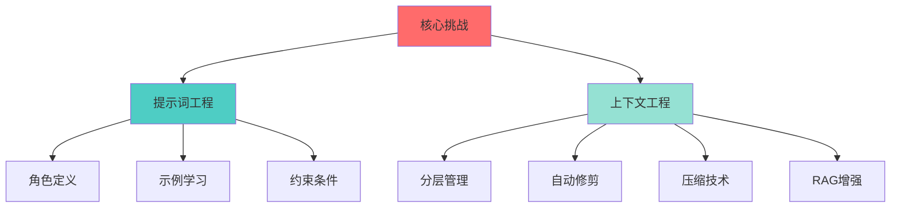

# 任务 05（直播）| 上下文工程：让智能体精准理解复杂任务需求

---

## 📋 课程信息

**讲师**: Agent 101 Team  
**时间**: 2025年12月  
**时长**: 90分钟  
**难度**: ⭐⭐⭐⭐  
**代码**: [prompt_to_context.ipynb](./prompt_to_context.ipynb)

---

## 目录

1. **核心痛点与挑战** - 为什么智能体"听不懂"话？
2. **提示词工程系统方法论** - 从简单到专业
3. **上下文工程核心策略** - 管理Token与质量的艺术
4. **实战演示** - 从基础提示到RAG增强
5. **最佳实践与总结** - 生产环境的经验法则

---

# Part 1: 核心痛点与挑战 🎯

---

## 为什么你的智能体"听不懂"话？

### 三大核心痛点

#### 1️⃣ 模型理解偏差
```text
❌ 你的期望: "帮我规划一个旅行"
🤖 模型输出: 泛泛而谈，没有具体信息

问题根源：
- 提示词过于模糊
- 缺乏角色定位
- 没有输出约束
```

#### 2️⃣ 上下文窗口限制
```text
⚠️ 挑战：
- GPT-4: 128K tokens，但有效记忆远小于此
- 对话越长，"遗忘"越快
- 无效信息充斥上下文

结果：
→ 模型在第20轮对话时忘记了第1轮的关键信息
→ Token消耗线性增长，成本失控
```

#### 3️⃣ 成本与质量的权衡
```text
💰 现实困境：
- 更长的提示 = 更高的成本
- 但短提示 = 低质量输出

数据：
Base提示(12 tokens) vs Comprehensive提示(164 tokens)
- 成本差: 13.7倍
- 质量差: ?（需要量化！）
```

---

## 解决方案全景图



### 两大核心技术

| 技术 | 目标 | 应用场景 | Notebook对应 |
|------|------|----------|--------------|
| **提示词工程** | 提升单次生成质量 | 明确任务需求 | `expanded_prompts` |
| **上下文工程** | 优化多轮交互效率 | 长对话、知识注入 | `calculate_metrics`, `prune_context_layers` |

---

# Part 2: 提示词工程系统方法论 📝

---

## 提示词的五大基本原则

### 1. 清晰性 (Clarity)
```python
❌ Bad: "写个旅游计划"
✅ Good: "请为期末考试后去上海的大学生，规划一个为期三天的旅游路线"
```

### 2. 具体性 (Specificity)
```python
❌ Bad: "规划行程"
✅ Good: "包含至少一个历史文化景点、一个现代都市景点、一个美食体验"
```

### 3. 角色定位 (Role)
```python
✅ Good: "你是一位熟悉上海的资深旅行博主"
→ 激活模型在旅游领域的专业知识
```

### 4. 结构化 (Structure)
```python
✅ Good:
"""
【任务】规划旅游路线
【受众】大学生
【要求】
- 预算友好
- 交通便捷
- 包含特色美食
"""
```

### 5. 可量化 (Measurable)
```python
✅ Good: "生成3个景点，每个景点包含名称、简介、预计游玩时间"
→ 明确输出格式，便于后续处理
```

---

## 进阶技巧 1: 角色扮演 (Role-Playing)

### 原理
为模型设定 **Persona**，激活特定领域的知识表示。

### 实验对比

```python
# Base Prompt
base_prompt = "请写一段关于旅游路线规划的说明文字。"

# With Role
role_prompt = """
你是一名专业的旅游规划师。
请写一段关于旅游路线规划的说明文字。
"""
```

### 实验结果（来自Notebook）

| 指标 | Base | With Role | 变化 |
|------|------|-----------|------|
| Prompt Tokens | 12 | 21 | +75% |
| Response Tokens | 380 | 323 | -15% |
| Latency | 8.98s | 4.50s | **-50%** ⭐ |
| Token Efficiency | 31.7 | 15.4 | -51% |

### 关键发现
- ✅ **响应速度提升50%** - 模型更快找到回答方向
- ✅ **内容专业度提升** - 输出更加结构化
- ⚠️ **效率降低** - 因为提示词变长

---

## 进阶技巧 2: 少样本学习 (Few-Shot Prompting)

### 原理：In-Context Learning
通过提供 **Input-Output 对**，让模型模仿模式。

### 代码示例

```python
few_shot_prompt = """
请写一段关于旅游路线规划的说明文字。

示例 1：
旅游路线规划是制定旅行行程的过程，包括选择目的地、交通方式、
住宿、景点和活动等。一个好的规划能帮助旅行者充分利用时间，
控制预算，并获得更好的旅行体验。

示例 2：
规划旅游路线时，需要考虑旅行时间、预算、旅行偏好（如文化、
自然、探险）、同行人员以及当地的气候和季节。
"""
```

### 实验结果

| 指标 | Base | With Examples | 变化 |
|------|------|---------------|------|
| Prompt Tokens | 12 | 118 | +983% 📈 |
| Response Tokens | 380 | 151 | -60% |
| Latency | 8.98s | 2.45s | **-73%** ⭐⭐ |

### 适用场景
- ✅ **格式规范任务** - JSON输出、表格生成
- ✅ **风格模仿** - 特定语气、文体
- ⚠️ **成本敏感应用** - Prompt Token大幅增加

---

## 进阶技巧 3: 约束与受众

### 约束 (Constraints)

```python
constraints_prompt = """
请写一段关于旅游路线规划的说明文字。

要求：
- 至少包含三个关键考虑因素（如预算、时间、偏好）
- 提及规划的好处
- 以'开始你的规划吧！'结尾
- 保持实用且易于理解的语气
"""
```

### 受众 (Audience)

```python
audience_prompt = """
请为第一次计划自由行的大学生，
写一段关于旅游路线规划的说明文字，
尽量使用简单易懂的语言和实用的建议。
"""
```

### 实验结果对比

| 提示类型 | Prompt Tokens | Response Tokens | 特点 |
|----------|---------------|-----------------|------|
| With Constraints | 62 | 256 | 结构清晰，覆盖要点 |
| With Audience | 35 | 440 | 语言通俗，内容详细 |

### 关键洞察
- **约束** → 控制输出结构
- **受众** → 调整语言风格和详细程度

---

## 综合模板化: The Ultimate Prompt

### 模板化函数

```python
def create_expanded_context(
    base_prompt: str,
    role: Optional[str] = None,
    examples: Optional[List[str]] = None,
    constraints: Optional[List[str]] = None,
    audience: Optional[str] = None,
    tone: Optional[str] = None,
    output_format: Optional[str] = None,
) -> str:
    """
    构建结构化的提示词
    """
    parts = []
    
    if role:
        parts.append(f"你的身份：{role}。")
    
    parts.append(base_prompt)
    
    if audience:
        parts.append(f"请确保你的回答适合：{audience}。")
    
    if tone:
        parts.append(f"请使用 {tone} 的语气进行回答。")
    
    if constraints:
        parts.append("要求：")
        parts.extend([f"- {c}" for c in constraints])
    
    if examples:
        parts.append("示例：")
        parts.extend([f"示例 {i+1}：\n{ex}" for i, ex in enumerate(examples)])
    
    return "\n\n".join(parts)
```

### 实战案例

```python
prompt = create_expanded_context(
    base_prompt="请为期末考试后去上海的大学生，规划一个为期三天的旅游路线。",
    role="一位熟悉上海的资深旅行博主",
    audience="期末考试后放松的大学生",
    tone="活泼有趣且实用",
    constraints=[
        "包含至少一个历史文化景点",
        "包含至少一个现代都市景点",
        "包含至少一个美食体验",
        "考虑交通便捷性",
        "行程安排不要过于紧凑",
    ],
)
```

### 生成结果（456 tokens）
> 第一天：欢迎来到活力四射的大上海！上午抵达后，先到酒店安顿好...
> （详细的三天行程规划，包含豫园、外滩、陆家嘴、迪士尼等景点）

---

# Part 3: 上下文工程核心策略 🔧

---

## 上下文窗口的挑战

### 量化指标体系

```python
def calculate_metrics(prompt: str, response: str, latency: float) -> Dict:
    """
    计算关键指标
    """
    pt = count_tokens(prompt)
    rt = count_tokens(response)
    
    return {
        "prompt_tokens": pt,
        "response_tokens": rt,
        "token_efficiency": rt / pt if pt > 0 else 0,  # 投入产出比
        "latency": latency,
        "latency_per_1k": (latency / (pt + rt)) * 1000 if (pt + rt) > 0 else 0,  # 每1k tokens时延
    }
```

### 四大核心指标

| 指标 | 含义 | 优化目标 |
|------|------|----------|
| **Prompt Tokens** | 输入成本 | ⬇️ 越低越好 |
| **Response Tokens** | 输出质量 | ⬆️ 适度即可 |
| **Token Efficiency** | 投入产出比 | ⬆️ 越高越好 |
| **Latency per 1k** | 标准化速度 | ⬇️ 越低越好 |

---

## 策略 1: 上下文分层管理

### 分层逻辑

```python
# 三层架构
layers = {
    # L1: 核心层 - 必须保留
    "core": {
        "task": "请规划旅游路线",
        "role": "你是专业旅行规划师",
    },
    
    # L2: 指导层 - 高价值
    "guidance": {
        "constraints": "包含历史景点、美食体验",
        "examples": "示例：第一天...",
    },
    
    # L3: 上下文层 - 可优化
    "context": {
        "audience": "目标受众：大学生",
        "history": "用户历史偏好...",
    },
}
```

### 优化策略

```python
# 测试不同层组合
def test_layered_contexts(base_prompt, context_layers):
    results = {}
    
    # 1. Base only
    results["base"] = test_prompt(base_prompt)
    
    # 2. Base + 单个层
    for layer_name, layer_content in context_layers.items():
        prompt = f"{base_prompt}\n\n{layer_content}"
        results[f"base+{layer_name}"] = test_prompt(prompt)
    
    # 3. Base + All layers
    all_layers = "\n\n".join(context_layers.values())
    results["all_layers"] = test_prompt(f"{base_prompt}\n\n{all_layers}")
    
    return results
```

---

## 策略 2: 自动化评估

### 模型评估模型

```python
def evaluate_response_quality(
    prompt: str, 
    response: str, 
    criteria: List[str]
) -> float:
    """
    使用LLM评估LLM的输出质量
    """
    crit = "\n".join([f"- {c}" for c in criteria])
    
    eval_prompt = f"""
请为以下响应基于标准打分，最后给出'总体评分：0.0-1.0'。

原始提示：
{prompt}

模型响应：
{response}

评估标准：
{crit}
"""
    
    eval_resp = generate_response(eval_prompt)
    
    # 提取评分
    import re
    m = re.findall(r"总体评分[:：]\s*([0-9]*\.?[0-9]+)", eval_resp)
    return float(m[-1]) if m else 0.5
```

### 评估标准示例

```python
criteria = [
    "行程规划是否合理，考虑了交通和节奏？",
    "是否包含了所有要求的景点类型？",
    "是否适合目标受众（大学生）？",
    "语气是否专业且有吸引力？",
    "是否包含了实用的细节信息？",
]
```

---

## 策略 3: 自动化上下文修剪

### 核心算法

```python
def prune_context_layers(base_prompt, layers, criteria):
    """
    递归修剪上下文层，保留高价值层
    """
    # 1. 测试基础提示
    base_quality = evaluate(base_prompt)
    
    # 2. 测试所有层组合
    full_quality = evaluate(base_prompt + all_layers)
    
    # 3. 逐个移除层并测试
    for layer_name in layers:
        # 移除当前层
        remaining = layers.copy()
        remaining.pop(layer_name)
        
        # 测试质量
        test_quality = evaluate(base_prompt + remaining)
        
        # 判断：质量提升 OR (质量持平 AND Token减少)
        if test_quality > full_quality + 0.05:
            # 递归继续修剪
            return prune_context_layers(base_prompt, remaining, criteria)
        elif abs(test_quality - full_quality) <= 0.05 and tokens_saved > 0:
            return prune_context_layers(base_prompt, remaining, criteria)
    
    # 无法进一步优化
    return best_prompt
```

### 实验结果：北京5日游案例

```text
初始配置：
- base + role + audience + constraints + example
- Tokens: 186
- Quality: 1.0

修剪过程：
Round 1: 移除 "role" → Quality: 1.0, Tokens: 171 ✅
Round 2: 移除 "constraints" → Quality: 1.0, Tokens: 118 ✅
Round 3: 移除 "example" → Quality: 1.0, Tokens: 45 ✅
Round 4: 移除 "audience" → Quality: 1.0, Tokens: 22 ✅

最终配置：
- 仅保留 base prompt
- Tokens: 22 (节省88%)
- Quality: 1.0 (保持不变)
```

### 关键发现
⚠️ **并非所有精心设计的层都是必要的！**

---

## 策略 4: 上下文压缩技术

### 三种压缩方法

#### 1. 摘要压缩 (Summarize)

```python
compress_prompt = f"""
请精炼以下上下文，保留关键信息并减少冗余：

{original_context}
"""
```

**效果**: 164 tokens → 129 tokens (-21%)

#### 2. 关键词提取 (Keywords)

```python
compress_prompt = f"""
请提取以下上下文的关键词与关键短语（逗号分隔）：

{original_context}
"""
```

**效果**: 164 tokens → 61 tokens (-63%) ⭐

#### 3. 要点列表 (Bullet Points)

```python
compress_prompt = f"""
请将以下上下文转换为结构化要点列表：

{original_context}
"""
```

**效果**: 164 tokens → 204 tokens (+24%) ⚠️

### 压缩方法对比

| 方法 | Token减少 | 信息保留度 | 适用场景 |
|------|-----------|------------|----------|
| 摘要 | 中 (-21%) | 高 | 需要连贯表述 |
| 关键词 | 高 (-63%) | 中 | 检索、分类 |
| 要点 | 低 (+24%) | 高 | 结构化输出 |

---

## 策略 5: RAG 检索增强生成

### 原理

```text
Context Window 有限 → 知识库无限

传统方式：将所有知识塞入Prompt
RAG方式：动态检索相关知识，按需注入
```

### 实现步骤

#### 步骤1: 构建知识库

```python
knowledge_base = [
    {
        "title": "旅游规划基础",
        "content": "旅游规划是制定旅行行程的过程，包括选择目的地、交通方式、住宿、景点和活动等。"
    },
    {
        "title": "预算控制",
        "content": "提前制定预算，包括交通、住宿、餐饮、门票、购物等各项开支。"
    },
    # ... 更多知识条目
]
```

#### 步骤2: 检索相关信息

```python
def retrieve_relevant_info(query: str, kb: List[Dict]) -> List[str]:
    """
    简单的关键词匹配检索
    """
    query_terms = set(query.lower().split())
    hits = []
    
    for item in kb:
        content = item['content'].lower()
        title = item['title'].lower()
        
        # 计算匹配得分
        score = sum(1 for term in query_terms if term in content or term in title)
        
        if score > 0:
            hits.append((score, item['content']))
    
    # 返回Top 3
    hits.sort(key=lambda x: x[0], reverse=True)
    return [h[1] for h in hits[:3]]
```

#### 步骤3: 增强上下文

```python
def create_rag_context(base_prompt: str, query: str, kb: List[Dict]) -> str:
    """
    结合检索信息构建RAG上下文
    """
    # 检索相关信息
    relevant_info = retrieve_relevant_info(query, kb)
    
    if not relevant_info:
        return base_prompt
    
    # 拼接
    return f"""{base_prompt}

相关知识：

{chr(10).join(relevant_info)}
"""
```

### 实验对比

#### Before RAG
```text
Query: "请简要讲解如何规划一次自由行。"
Response: 泛泛而谈的通用建议...
```

#### After RAG
```text
Query: "请简要讲解如何规划一次自由行。"
Context: base_prompt + 检索到的"预算控制"、"交通方式选择"
Response: 
1. 选择目的地（考虑时间、预算、偏好）
2. 确定旅行时间（避开高峰期）
3. 预算规划（详细列出各项开支）
4. 预订交通（提前预订获取优惠）
5. 选择住宿（考虑位置、价格、设施）
...
（包含了具体的来自知识库的建议）
```

### RAG的价值

- ✅ **知识时效性** - 随时更新知识库，无需重新训练模型
- ✅ **成本控制** - 仅注入相关知识，不浪费Token
- ✅ **领域专业化** - 通用模型秒变领域专家
- ⚠️ **检索质量** - 依赖检索算法的准确性

---

# Part 4: 实战演示 💻

---

## 实战 1: 基础 vs 扩展提示

### 实验设计

测试6种提示配置：
1. Base - 最小提示
2. With Role - 添加角色
3. With Examples - 添加示例
4. With Constraints - 添加约束
5. With Audience - 添加受众
6. Comprehensive - 综合所有层

### 可视化结果

```text
📊 Token Usage by Prompt Type
━━━━━━━━━━━━━━━━━━━━━━━━━━━━━━
base          ██████████ (392 total)
with_role     ████████ (344 total)
with_examples █████ (269 total)
with_constraints ██████ (318 total)
with_audience ████████████ (475 total)
comprehensive ████████████ (436 total)
```

```text
📊 Token Efficiency (Response/Prompt)
━━━━━━━━━━━━━━━━━━━━━━━━━━━━━━
base          ████████████████ (31.7)
with_role     ██████████ (15.4)
with_examples ██ (1.3)
with_constraints ████ (4.1)
with_audience ████████ (12.6)
comprehensive ██ (1.7)
```

```text
📊 Latency per 1k Tokens (lower is better)
━━━━━━━━━━━━━━━━━━━━━━━━━━━━━━
comprehensive ████ (8.44ms)
with_constraints ████ (8.93ms)
with_examples █████ (9.11ms)
with_audience ██████ (11.8ms)
with_role ███████ (13.1ms)
base          ████████████ (22.9ms)
```

### 关键洞察

1. **Base提示效率最高，但质量不可控**
   - Token Efficiency = 31.7（最高）
   - 但Latency per 1k = 22.9ms（最慢）
   - 原因：模型需要"猜测"输出格式

2. **Examples提示最快**
   - 绝对Latency = 2.45s（最快）
   - 提供了明确的输出模板

3. **Comprehensive提示最稳定**
   - Latency per 1k = 8.44ms（最快）
   - 单位工作量效率最高

---

## 实战 2: 自动化层剪枝

### 场景：北京5日游规划

```python
prune_test_prompt = "请为期末考试后去北京的大学生，规划一个为期五天的旅游路线。"

context_layers = {
    "role": "你的身份：一位熟悉北京的资深旅行博主。",
    "audience": "目标读者：期末考试后放松的大学生，对历史文化和现代都市都感兴趣。",
    "constraints": """要求：
- 包含故宫和长城
- 包含至少一个艺术区或创意园区
- 包含至少一种北京特色小吃体验
- 考虑公共交通便捷性
- 行程安排劳逸结合""",
    "example": """示例：
第一天：上午抵达北京，前往酒店。下午参观故宫，感受皇家气派。晚上可以在王府井大街品尝北京烤鸭。
第二天：上午前往慕田峪长城，体验壮丽景色。下午返回市区，参观798艺术区。""",
}

criteria = [
    "行程规划是否合理，考虑了交通和节奏？",
    "是否包含了故宫和长城？",
    "是否包含了至少一个艺术区或创意园区？",
    "是否包含了至少一种北京特色小吃体验？",
    "是否适合期末考试后放松的大学生？",
    "作为旅行博主，语气是否专业且有吸引力？",
]
```

### 剪枝过程

```text
━━━━━━━━━━━━━━━━━━━━━━━━━━━━━━
Round 0: 初始测试
━━━━━━━━━━━━━━━━━━━━━━━━━━━━━━
✓ base: Quality=0.90, Tokens=22
✓ all_layers: Quality=1.0, Tokens=186

━━━━━━━━━━━━━━━━━━━━━━━━━━━━━━
Round 1: 测试单层移除
━━━━━━━━━━━━━━━━━━━━━━━━━━━━━━
  without_role: Quality=1.0, Tokens=171 ⭐
  without_audience: Quality=0.95, Tokens=163
  without_constraints: Quality=0.90, Tokens=133
  without_example: Quality=0.90, Tokens=112

→ 发现可移除层：role（质量不降，Token减少15）

━━━━━━━━━━━━━━━━━━━━━━━━━━━━━━
Round 2: 继续测试（移除role后）
━━━━━━━━━━━━━━━━━━━━━━━━━━━━━━
  without_audience: Quality=1.0, Tokens=148
  without_constraints: Quality=1.0, Tokens=118 ⭐
  without_example: Quality=0.90, Tokens=97

→ 发现可移除层：constraints（质量保持，Token减少53）

━━━━━━━━━━━━━━━━━━━━━━━━━━━━━━
Round 3: 继续测试
━━━━━━━━━━━━━━━━━━━━━━━━━━━━━━
  without_audience: Quality=0.83, Tokens=95
  without_example: Quality=1.0, Tokens=45 ⭐

→ 发现可移除层：example（质量提升！）

━━━━━━━━━━━━━━━━━━━━━━━━━━━━━━
Round 4: 最后测试
━━━━━━━━━━━━━━━━━━━━━━━━━━━━━━
  without_audience: Quality=1.0, Tokens=22 ⭐

→ 发现可移除层：audience

━━━━━━━━━━━━━━━━━━━━━━━━━━━━━━
最终结果
━━━━━━━━━━━━━━━━━━━━━━━━━━━━━━
✅ 最优提示：base only
✅ Quality: 1.0 (保持满分)
✅ Tokens: 22 (节省88%成本！)
```

### 惊人发现

**所有精心设计的层都被剪掉了！**

原因分析：
1. **Base提示已经足够清晰** - 包含了关键信息（地点、受众、时长）
2. **模型内置知识强大** - GPT-4对北京旅游很熟悉
3. **额外层可能引入噪音** - 过多约束反而限制了模型发挥

启示：
> **Less is More！用数据说话，不要盲目堆砌提示层。**

---

## 实战 3: RAG知识注入

### 场景：自由行规划咨询

#### Without RAG

```python
prompt = "请简要讲解如何规划一次自由行。"
response = generate_response(prompt)
```

**输出**:
```text
规划一次自由行需要考虑以下几个方面：

1. 选择目的地
2. 确定旅行时间
3. 预算规划
4. 预订交通和住宿
...（泛泛而谈）
```

#### With RAG

```python
# 构建知识库
kb = [
    {"title": "预算控制", "content": "提前制定预算，包括交通、住宿、餐饮、门票、购物等各项开支，并在旅行中尽量遵守。"},
    {"title": "安全注意事项", "content": "了解目的地安全情况，保管好个人财物，遵守当地法律法规，购买旅行保险。"},
    # ... 更多
]

# 检索增强
query = "旅游规划 自由行 步骤"
rag_context = create_rag_context(prompt, query, kb)
response = generate_response(rag_context)
```

**输出**:
```text
规划一次自由行需要仔细考虑多个方面，以确保旅行顺利且愉快。以下是一些步骤：

1. **选择目的地**：
   - 根据个人兴趣、预算和时间选择适合的目的地。
   - 了解目的地的气候、文化和主要景点。

2. **预算规划**（来自知识库）：
   - 制定旅行预算，包括交通、住宿、餐饮、景点门票和购物等。
   - 留出一定的应急资金以应对意外情况。

3. **预订交通**：
   - 根据目的地选择适合的交通方式，如飞机、火车或自驾。
   - 尝试提前预订以获取优惠价格。

...

9. **购买旅行保险**（来自知识库）：
   - 考虑购买旅行保险以保护自己免受意外事件的影响。
```

### 对比分析

| 维度 | Without RAG | With RAG |
|------|-------------|----------|
| **信息来源** | 模型内置知识 | 模型 + 知识库 |
| **内容深度** | 泛泛而谈 | 具体详细 |
| **时效性** | 训练截止日期 | 实时更新 |
| **专业性** | 通用建议 | 领域专家级 |
| **Token成本** | 低（12 tokens） | 中（45 tokens） |

### RAG最佳实践

1. **何时使用RAG**
   - ✅ 领域知识密集型任务
   - ✅ 需要实时/最新信息
   - ✅ 模型训练数据不足的领域

2. **检索质量至关重要**
   - 本例使用简单关键词匹配
   - 生产环境建议：向量检索（Embedding + 相似度搜索）

3. **知识库设计**
   - 结构化：便于检索和更新
   - 粒度适中：不要太细（检索噪音）也不要太粗（信息不足）
   - 元数据丰富：title, tags, source, timestamp

---

# Part 5: 最佳实践与总结 🎓

---

## 生产环境的经验法则

### 1. 提示词设计原则

#### ✅ DO
```python
# 清晰的结构
prompt = """
## 任务
{task_description}

## 输入
{input_data}

## 输出要求
- 格式：JSON
- 字段：name, description, price
- 约束：price必须为数字

## 示例
输入：电脑
输出：{"name": "MacBook Pro", "description": "...", "price": 12999}
"""
```

#### ❌ DON'T
```python
# 模糊不清
prompt = "帮我处理一下这个数据，要好看点"
```

### 2. Token管理策略

#### 成本控制公式

```python
total_cost = (prompt_tokens * input_price + response_tokens * output_price) / 1000

# 以GPT-4为例
input_price = 0.03 USD / 1k tokens
output_price = 0.06 USD / 1k tokens

# 优化目标
目标 = min(total_cost) while maintaining quality_threshold
```

#### 优化手段

| 手段 | 节省幅度 | 质量影响 | 适用场景 |
|------|----------|----------|----------|
| 压缩 | 20-60% | 低 | 所有 |
| 修剪 | 30-80% | 中 | 复杂提示 |
| 缓存 | 50-90% | 无 | 重复调用 |
| RAG | 10-30% | 正向 | 知识密集 |

### 3. 质量保障体系

```python
# 多维度评估
def evaluate_production_quality(response):
    scores = {}
    
    # 1. 格式正确性
    scores['format'] = check_format(response)
    
    # 2. 内容完整性
    scores['completeness'] = check_required_fields(response)
    
    # 3. 事实准确性
    scores['accuracy'] = verify_facts(response)
    
    # 4. 安全性
    scores['safety'] = check_harmful_content(response)
    
    # 5. 一致性
    scores['consistency'] = check_with_history(response)
    
    return scores
```

### 4. 监控告警

```python
# 关键指标监控
monitoring_metrics = {
    'latency_p99': 5.0,  # 99分位延迟 < 5s
    'token_avg': 500,     # 平均Token < 500
    'error_rate': 0.01,   # 错误率 < 1%
    'quality_score': 0.8, # 质量分 > 0.8
}

# 告警规则
if latency > monitoring_metrics['latency_p99']:
    alert("高延迟告警")

if token_usage > monitoring_metrics['token_avg'] * 1.5:
    alert("Token使用异常")
```

---

## 实战Checklist

### 🔍 提示词设计阶段

- [ ] 明确任务目标和成功标准
- [ ] 定义清晰的角色和受众
- [ ] 提供2-3个高质量示例
- [ ] 列出明确的约束条件
- [ ] 指定输出格式（JSON/Markdown/表格）
- [ ] 添加错误处理指令（"如果不确定，请说明"）

### 📊 优化阶段

- [ ] 建立基线指标（Base提示的表现）
- [ ] 逐层添加上下文，测量影响
- [ ] 使用自动化评估脚本
- [ ] 进行消融实验（移除单个层）
- [ ] 压缩冗余信息
- [ ] 考虑RAG集成

### 🚀 部署阶段

- [ ] 设置Token上限（防止成本失控）
- [ ] 实现提示词版本管理
- [ ] 添加日志和监控
- [ ] 准备降级方案（API失败时）
- [ ] 定期A/B测试新版本提示词

---

## 常见陷阱与解决方案

### 陷阱1: 过度工程化

**问题**:
```python
# 800 tokens的复杂提示
comprehensive_prompt = """
你是一位拥有20年经验的资深旅行规划师，专精于亚太地区...
（大量的角色描述、历史背景、示例...）
"""
```

**解决**:
```python
# 50 tokens的精简提示
simple_prompt = """
作为旅行规划师，为大学生规划3天上海行程。
要求：景点+美食+交通，预算友好。
"""
```

**教训**: 
> 先用最简单的提示测试，确认复杂化确实能提升质量后再添加。

---

### 陷阱2: 忽视评估

**问题**:
```python
# 凭感觉优化
"这个提示看起来更好" ❌
```

**解决**:
```python
# 数据驱动
def compare_prompts(prompt_a, prompt_b, test_cases):
    results_a = [evaluate(prompt_a, case) for case in test_cases]
    results_b = [evaluate(prompt_b, case) for case in test_cases]
    
    return {
        'prompt_a': {
            'avg_quality': mean(results_a),
            'avg_tokens': mean([r.tokens for r in results_a]),
        },
        'prompt_b': {
            'avg_quality': mean(results_b),
            'avg_tokens': mean([r.tokens for r in results_b]),
        }
    }
```

---

### 陷阱3: 硬编码知识

**问题**:
```python
# 将知识硬编码在提示中
prompt = """
北京景点：故宫、长城、天安门...（100个景点）
上海景点：外滩、东方明珠...（100个景点）
...
"""
```

**解决**:
```python
# 使用RAG动态注入
query = f"用户想去{destination}"
relevant_attractions = retrieve_from_kb(query)
prompt = f"推荐{destination}景点，参考：{relevant_attractions}"
```

---

### 陷阱4: 忽视边界情况

**问题**:
```python
prompt = "规划旅行路线"
# 用户输入："我想去火星"
# 模型："好的，第一天火星基地..."（胡说八道）
```

**解决**:
```python
prompt = """
规划旅行路线。

注意事项：
- 如果目的地不是地球上的真实地点，请说明无法提供建议
- 如果缺少必要信息（如旅行天数、预算），请主动询问
- 如果目的地存在安全风险，请提醒用户
"""
```

---

## 技术演进趋势

### 当前（2025）

```text
提示词工程 = 手工艺
- 人工设计提示词
- 手动测试优化
- 经验驱动
```

### 近期（2025-2026）

```text
上下文工程 = 半自动化
- 自动修剪工具
- 模型评估模型
- 数据驱动
```

### 未来（2026+）

```text
智能上下文管理 = 全自动
- 提示词自动生成
- 自适应上下文调整
- 多模态融合（文本+图像+音频）
- 端到端优化
```

---

## 学习资源推荐

### 📚 必读论文

1. **Chain-of-Thought Prompting**
   - Wei et al., 2022
   - 核心：让模型"展示思考过程"

2. **Retrieval-Augmented Generation (RAG)**
   - Lewis et al., 2020
   - 核心：结合检索与生成

3. **Self-Consistency**
   - Wang et al., 2023
   - 核心：多次采样投票

### 🛠️ 实用工具

| 工具 | 用途 | 链接 |
|------|------|------|
| **LangChain** | 提示词模板管理 | langchain.com |
| **Tiktoken** | Token计数 | github.com/openai/tiktoken |
| **Prompt Perfect** | 提示词优化 | promptperfect.jina.ai |
| **Langfuse** | 监控与追踪 | langfuse.com |

### 💡 最佳实践案例

1. **OpenAI Cookbook**
   - github.com/openai/openai-cookbook
   - 官方示例和最佳实践

2. **Awesome Prompt Engineering**
   - github.com/promptslab/Awesome-Prompt-Engineering
   - 社区精选资源

---

## 课程回顾

### 核心知识点

1. **提示词工程** = 单次质量优化
   - 角色、示例、约束、受众
   - 模板化、结构化

2. **上下文工程** = 长期效率优化
   - 分层管理、自动修剪
   - 压缩技术、RAG增强

3. **量化评估** = 数据驱动决策
   - Token效率、延迟指标
   - 模型自评、消融实验

### 关键结论

✅ **Less is More**
- 不要盲目堆砌上下文
- 用自动化工具验证每一层的价值

✅ **数据驱动**
- 建立指标体系（Token、Latency、Quality）
- A/B测试，用数据说话

✅ **动态上下文**
- RAG > 硬编码
- 按需注入 > 全量塞入

✅ **持续优化**
- 监控生产环境表现
- 定期更新提示词版本

---

## 互动环节 🙋

### 现场演示

**挑战**: 优化一个真实业务场景的提示词

**步骤**:
1. 听众提供一个任务描述
2. 现场编写Base提示
3. 逐步添加层并测量
4. 自动修剪优化
5. 对比前后效果

---

## Q&A 环节

### 常见问题

**Q1: 如何判断是否需要Few-Shot示例？**

A: 
- 如果任务有明确的格式要求（如JSON） → 必须
- 如果任务依赖特定的风格/语气 → 推荐
- 如果任务很简单 → 不需要

**Q2: RAG的检索算法如何选择？**

A:
```python
# 简单场景：关键词匹配
if knowledge_base_size < 1000:
    use keyword_matching

# 中等场景：TF-IDF
elif knowledge_base_size < 10000:
    use tfidf_retrieval

# 复杂场景：向量检索
else:
    use embedding_search (e.g., FAISS, Pinecone)
```

**Q3: 如何处理多轮对话的上下文管理？**

A:
```python
# 策略1: 滑动窗口
keep_last_n_turns = 5

# 策略2: 摘要历史
if conversation_length > 10:
    history = summarize(conversation[:-3]) + conversation[-3:]

# 策略3: 关键信息提取
context = extract_key_facts(conversation) + latest_turn
```

---

## 课后作业 📝

### 任务1: 优化你的业务提示词

1. 选择一个实际任务
2. 编写Base提示并测试
3. 应用本课学到的技巧逐步优化
4. 记录每一步的指标变化
5. 提交优化报告

### 任务2: 构建简单RAG系统

1. 准备一个小型知识库（10-20条）
2. 实现关键词检索函数
3. 测试RAG vs 非RAG的效果对比
4. 尝试不同的检索策略

### 任务3: 自动化评估脚本

1. 定义5个评估标准
2. 编写`evaluate_response_quality`函数
3. 在5个测试用例上验证
4. 分析评估的稳定性

---

## 下期预告 🚀

### 任务 06 | Agent工具调用与编排

- **核心内容**:
  - Function Calling原理与实践
  - 工具链设计与编排
  - MCP协议集成
  - 错误处理与重试机制

- **实战项目**:
  - 构建一个天气查询Agent
  - 集成多个外部API
  - 实现工具链路追踪

---

## 参考资源 📚

### 课程资料

- **Notebook**: `prompt_to_context.ipynb`
- **PPT**: 本文档
- **代码仓库**: github.com/FlyAIBox/Agent_In_Action

### 联系方式

- 📧 **邮箱**: fly910905@sina.com
- 🔗 **公众号**: 萤火AI百宝箱
- 💬 **社区**: Agent 101 学习群

---

## 致谢 🙏

感谢所有参与本次直播的学员！

**特别感谢**:
- OpenAI 提供的强大模型
- LangChain 社区的工具支持
- 所有贡献代码和反馈的同学

---

<div align="center">

# 谢谢观看！

**Keep Building, Keep Learning!** 🚀

⭐ **如果觉得有帮助，请给项目加星支持！** ⭐

</div>

